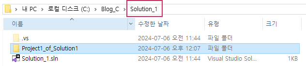
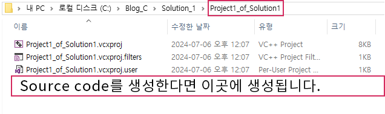
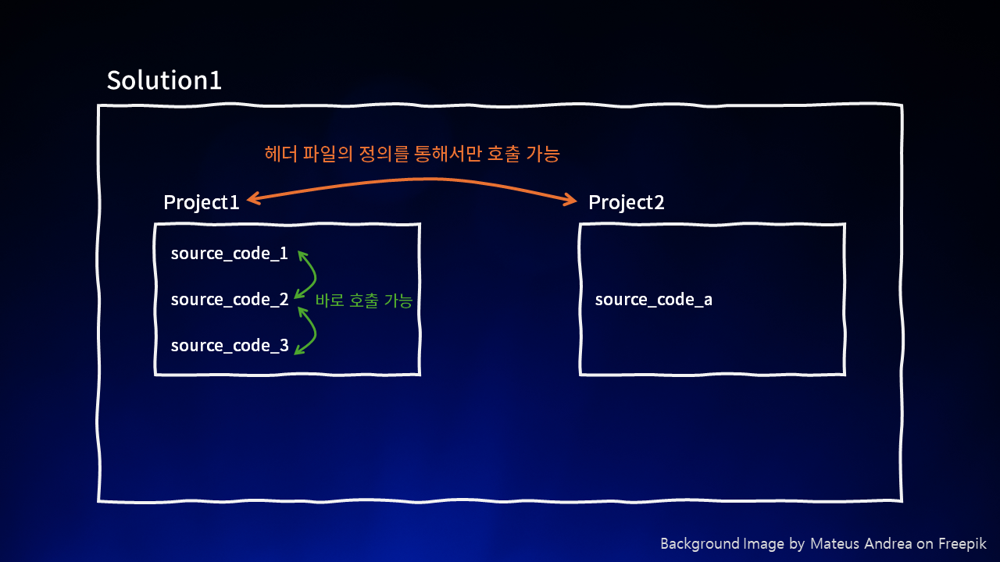

# C | Visual Studio 소스 코드만 제출, 프로젝트 파일만 제출

## Introduction
대학이나 기타 기관 등에서 C/C++과 관련된 수업을 듣게 된다면 대부분 Visual Studio를 IDE로 사용하게 된다.  
이때 과제나 시험 문제 풀이 등을 제출할 때 교수가 **다음과 같이 요구하는 경우**가 많다.  
    
<aside> 🗣️ <b>소스 파일만</b> 제출하세요! </aside>
 
<aside> 🗣️ <b>프로젝트 파일</b> 제출하세요! </aside>
  

이때 교수의 요구대로 제출하지 못하면 **감점되거나, 0점 처리** 당하는 경우가 생길 수 있으니 다음과 같은 부분들을 알아보자.

* Visual Studio에서 C언어 관련 파일을 어떻게 구분하고, 관리하는가?
* `소스 코드`, `프로젝트`, `솔루션`의 차이가 무엇인가?

## 1. Visual Studio의 파일 관리 구조

### 1. Solution만 생성했을 때
Solution을 생성하면 `Solution_name`과 같은 폴더가 생성되고, 내부에 `Solution_name.sln` 파일과 `.vs` 폴더가 생성된다.  

### 2. Project 생성
이제 `Solution_1` 하위에 `Project1`를 생성해보자.  
(해당 실습과는 관련없음)이때 Solution 옵션을 **Add to solution**이 아닌 **Create new solution**으로 설정하면 프로젝트명과 동일한 솔루션을 자동으로 생성하고 그 하위에 프로젝트를 생성한다.  
  
*기존에 생성했던 Solution_1 하위에 Project를 생성*  

  
*Visual Studio에서 확인*  

  
*Solution_1 폴더에서 확인*  

이때 `Project` 내부에서는 `Source code 파일`을 관리할 수 있다.  
  
*Source code를 생성한다면 이곳에 생성된다.*

### 3. Project1 내부에 여러 source code 생성하기
다음과 같이 한 프로젝트에서는 여러 개의 source code를 생성하고, 관리할 수 있다.  
또한 동일한 프로젝트 내에서 정의된 source code끼리는 별 다른 설정을 하지 않고도 서로의 함수를 호출할 수 있다.  
> 다른 프로젝트에 있는 함수를 호출하기 위해서는 헤더 파일을 정의하는 것이 필수적이다.  
(사실 **같은 프로젝트 내의 함수이더라도** 가독성이나 컴파일러 오류 방지를 위해서 **헤더 파일을 정의하는 것이 권장**되지만, 해당 게시글에서는 단순히 ‘같은 프로젝트 내에 있다’라는 것이 무엇인지에 대해 이해하기 위해서 위와 같이 설명했다.)

  
*`Project1_of_Solution1`이라는 동일한 프로젝트 내에 존재하는 `source_code_1, 2, 3.c`이다.
동일한 프로젝트 내에 존재하기 때문에 별 다른 설정없이 서로 간의 함수 호출이 가능하다.*

  
*동일 프로젝트 간의 함수는 별 다른 설정없이 호출할 수 있다.*

### Project1에서 Project2의 함수 호출을 시도하기
이번에는 `Project2`에 다음과 같이 `source_code_a.c`를 생성하고, Project1에서 호출을 시도하도록 하자.  
  
*`Project1`과 다른 `Project2`에 생성된 `source_code_a.c`*  

  
*`kbsa()` 함수는 `Project1`과 다른 프로젝트인 `Project2`에서 생성되고, 관리되기 때문에 호출할 수 없다.
(서로 다른 프로젝트 간에는 헤더 파일의 정의를 통해 호출할 수 있지만, 해당 내용은 본 게시글에서는 다루지 않는다.)*  

## 2. 그림으로 알아보기
위에서 알아본 내용들을 다음 그림과 같이 정리할 수 있다.  
  

## 결론: 소스 코드 / 프로젝트 파일로 제출하려면 어떻게 하는가?

### 1. 소스 코드만 제출하는 방법
소스 코드만 제출하기 위해서는 다음과 같은 단계를 거쳐 소스 코드가 존재하는 폴더로 이동할 수 있다. 내 경우에는 `Solution_1 솔루션`의 `Project1_of_Solution1 프로젝트`에서 생성한 `source_code_1.c 소스코드`로 가정하겠다.  

1. 본인이 제출하려는 소스 코드가 포함된 프로젝트가 포함된 솔루션 폴더로 이동  

내 경우에는 다음과 같다. `C:\Blog_C\Solution_1`  
  
    
2. 본인이 제출하려는 소스 코드가 포함된 프로젝트 폴더로 이동  

`C:\Blog_C\Solution_1\Project1_of_Solution1`  
  
    
3. 본인이 제출하려는 소스 코드를 그대로 제출하거나, 압축하여 제출하면 끝.  

  

### 2. 프로젝트 파일로 제출하는 방법
1. 위 1번을 참고해서 `C:\Blog_C\Solution_1`과 같이 솔루션 폴더까지만 이동한다.
2. 본인이 제출하려는 소스 코드가 포함된 프로젝트 `Project_of_Solution1` 폴더를 압축하여 제출한다.

    

### **프로젝트 폴더에 소스 코드가 없는 상황!
분명히 나는 프로젝트에서 소스 코드를 생성하고, 저장했는데 프로젝트 폴더로 가서 확인해보면 소스 코드가 존재하지 않는 경우가 있습니다. 컴파일이나 빌드, 실행도 모두 정상적으로 되는데 말이다.  
다음과 같이 malloc1.c가 Project1_of_Solution1 프로젝트에 존재하고, 실행도 잘 되는 것을 확인했는데 막상 프로젝트 폴더로 가보니 소스 코드가 존재하지 않는 당황스러운 일이 발생했다.  

  

  

---

소스 코드를 생성할 때는 `새 항목(New Item)`과 `기존 항목(Existing Item)` 중에서 선택할 수 있는데 `기존 항목`으로 소스 코드를 생성한 경우 위와 같은 현상이 발생한다.  

이때는 다음과 같은 선택지 중에서 선택하여 문제를 해결할 수 있다.  
* 소스 코드만 제출해야 된다면?
    - `기존 항목`으로 불러왔던 소스 코드를 찾아서 제출하면 된다.
* 프로젝트로 제출해야 된다면?
    - 방법1. `기존 항목`으로 불러왔던 소스 코드를 복사하여 프로젝트 폴더로 붙여넣기한다.
    - 방법2. `기존 항목`으로 불러왔던 소스 코드를 프로젝트 폴더로 이동시킨다.
    - 방법3. `새 항목`으로 빈 소스 코드 파일을 생성하고, 기존에 작성하던 소스 코드의 내용을 복사하여 붙여넣기한다.
