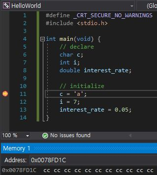
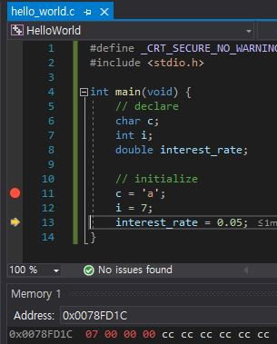

```C
// declare
char c;
int i;
double interest_rate;

// initialize
c = 'a';
i = 7;
interest_rate = 0.05;
```

initialize없이 declare만 한다면, garbage value가 보관됨.  
(다음 사진)  
`int i;`는 integer value를 보관할 수 있는 variable i를 declare함. 따라서 4byte 만큼의 memory가 allocated.  

  
*`&i`를 통해서 i의 memory address로 접근 가능.*
*`i`는 int type이므로 4byte할당되고, garbage value로 채워짐.*  
*일반적으로 Visual Studio에서 garbage value는 `cc`임.*  
*따라서 `0x0078FD1C`가 `i`의 memory address이고, `cc cc cc cc`까지가 `i`에게 allocate된 memory 공간임.*  
*그 뒤에도 `cc`가 이어지지만 이는 우연의 일치이고, 네 번째 `cc` 이후로는 `i`의 공간 아님.*  

  
*declare 후에 __처음으로 value를 보관하는 것__을 __initialize__라고 함.*  
*이때 `7`을 보관하기 위해서는 1byte만 있으면 되기 때문에, 나머지 공간은 `00`으로 채움.*
